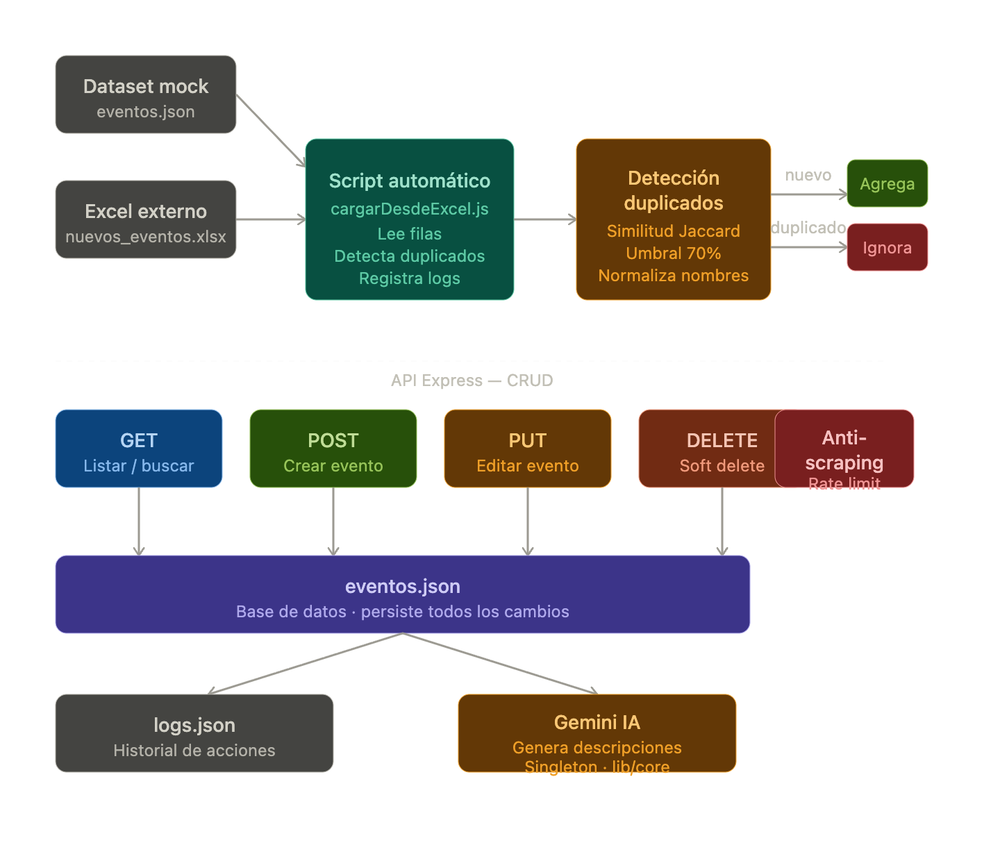

# Tucumán Eventos API — Sistema Automatizado con IA

Sistema integral desarrollado para la obtención, procesamiento y administración de establecimientos y eventos en San Miguel de Tucumán. Este proyecto integra automatización de datos mediante archivos externos, detección inteligente de duplicados y enriquecimiento de contenido a través de Inteligencia Artificial.

---

## 🚀 Stack Tecnológico

- **Runtime:** Node.js + Express (API REST)
- **Persistencia:** JSON File System (Base de datos simulada)
- **Procesamiento de Datos:** Librería `xlsx` para ingesta de datasets.
- **Inteligencia Artificial:** SDK `@google/generative-ai` (Gemini API).
- **Seguridad:** `express-rate-limit` para mitigación de scraping.

---

## ⚙️ Instalación y Configuración

### 1. Clonado del Proyecto
```bash
git clone [https://github.com/sofiarossi1909-ops/tucuman-eventos.git](https://github.com/sofiarossi1909-ops/tucuman-eventos.git)
cd tucuman-eventos

2. Gestión de DependenciasBashnpm install
3. Variables de EntornoConfigurar un archivo .env en la raíz del proyecto basado en el archivo .env.example:Fragmento de códigoGEMINI_API_KEY=tu_api_key_aqui
PORT=3000
Nota técnica: La integración utiliza el plan gratuito de Google AI Studio. En caso de experimentar errores 429 (Too Many Requests), el sistema incluye pausas controladas, pero se recomienda procesar los datos en lotes reducidos.

Flujo de Automatización e IA
El sistema cuenta con un flujo de trabajo diseñado para garantizar la integridad y calidad de la información:

Ingesta: Lectura de datos externos desde archivos Excel.

Detección de Duplicados: Implementación de un algoritmo de similitud basado en Bigramas de Jaccard para identificar registros existentes aunque los nombres presenten ligeras variaciones.

Enriquecimiento con IA: Generación automática de descripciones comerciales y clasificación de categorías.

Auditoría: Registro detallado de cada operación en un sistema de logs persistente.

Arquitectura del Sistema
📋 Endpoints Principales
CRUD de Eventos

Método, Ruta, Descripción
GET, /eventos, Lista todos los eventos activos
POST, /eventos, Crea un nuevo evento manualmente
PUT, /eventos/:id ,Edita un evento existente
DELETE, /eventos/:id, Desactiva (soft delete) un registro

Servicios de IA

Método, Ruta, Descripción
POST, /ia/describir/:id, Genera descripción para un evento específico
POST, /ia/describir-todos, Procesa todos los registros pendientes

Protección Anti-Scraping
La API implementa capas de seguridad para garantizar un uso responsable de los recursos:

Rate Limiting: Restricción de peticiones por IP (máx. 100 cada 15 min).

Validación de User-Agent: Rechazo automático de peticiones sin cabeceras válidas.

Bloqueo de Bots: Identificación y bloqueo de herramientas de scraping automatizado.

Criterio Técnico y Escalabilidad

Detección Inteligente
Se utiliza normalización de cadenas y análisis de similitud para detectar que registros como "Bar El Español" y "El Español Bar" son duplicados, evitando la redundancia de datos.

Mejoras Futuras
Persistencia: Migración hacia MongoDB o PostgreSQL para soportar concurrencia.

Validación: Integración con la API de Google Maps para normalización de direcciones.

Asincronismo: Implementación de colas (Redis) para el procesamiento masivo con IA.

Bonus Implementados
[x] Dashboard: Interfaz básica en HTML para visualización de datos.

[x] Historial de cambios: Logs de auditoría accesibles vía API.

[x] Soft Delete: Sistema de desactivación de registros sin pérdida de datos.

[x] Detección Difusa: Manejo avanzado de inconsistencias en nombres.


Desarrollado por Sofía Rossi — Tucumán, Argentina.




